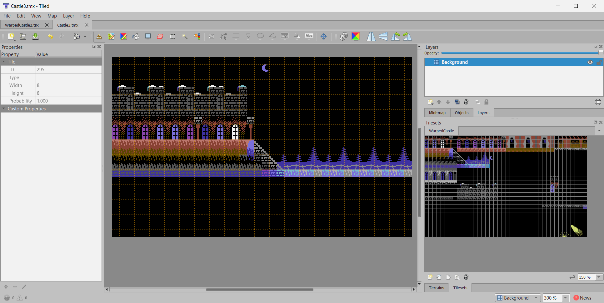

# TiledC64
 Converts Tiled maps to C64 binary data. This tool is a command line tool that converts .tmx files and does not extend or modify the Tiled editor.

 ## Tiled

 Tiled is a popular open source 2D map editor: [MapEditor.org](https://www.mapeditor.org)

* [Setting up a project in Tiled](setup.md)
* [Overview of TiledC64](overview.md)
* [Merging binary map data](merging.md)
* [Using an image instead of a map](image.md)

## Command Line Options

Note that all customization and destination files are set up as User Properties in each layer in Tiled.

*Converting a .tmx file to binary*

	TiledC64 \<map.tmx\> [-palette=\<image\>]

*Merge binary map data*

	TiledC64 -merge <mergelist> <shared destination>

*Use an image instead of a .tmx file as the map*

	TiledC64 -img <image> [-col=#,#,#,#] [-meta=wid,hgt] [-screenBits=#] [-colorBits=#] [-metaMapBits=#] [-metaLookupBits=#] [-type={mode}] [-export=<destination>] [-stats=<output.txt>]
Where the type is one of the following modes:
* Text
* TextNC* (in development)
* ECBM
* Bitmap
* BitmapMC* (in development)

## Why

Map editing by itself works great with existing tools and there are plenty of options available. This tool addresses the combined issue of specific hardware requirements plus a large set of options to customize the result.

My curent method for making 2D maps for the C64 has been to create the map in PixCen which is primarily a painting tool, then make a custom tool to convert it to a binary format I want.

Attempting to make a 4k game this way means I would spend a lot of time placing tiles, then time to make another tool to try to get the data as small as possible.

For example, in Shovel Knight 64 the screens are 1000 screen bytes + 500 color bytes + characters for each but that would be ok with a cartridge.

For the new project I want to minimize the size so by using 5x5 sized meta tiles each screen is instead 40 bytes with the bulk of memory in a shared pool of character data, screen and color data for each tile, etc.

