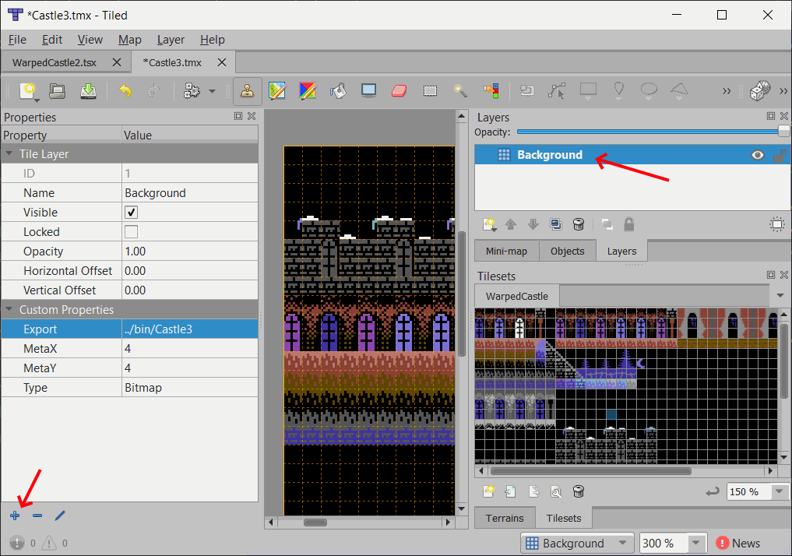

# TiledC64 Overview

The idea of TiledC64 is simply to load a Tiled .tmx file (map) and process it for saving out binary files that can be used in C64 programs.

The tool will export to the following formats:
* Text Mode
* Multicolor Text Mode*
* Extended Background Color Mode
* Hires Bitmap Mode
* Multicolor Bitmap Mode*

*) Multicolor is under implementation

There are various ways to control the size of the maps
* Meta Tiles can make the screen data smaller
    * Store screen and color data in reusable chunks
* Specify how many bits each kind of data is stored as
    * Screen, Color, Meta Map, Meta Lookup
* Merge exported maps to share identical data
    * 8x8 character data
    * Meta screen tiles
    * Meta color tiles
    * Meta lookup

## Setting properties

TiledC64 works by checking user properties on each layer.

To add user properties click on the Layer in the Layer View,
then press **+** to add a user property. This can be any property from this list:
* **Type** with a value of:
    * **Text**
    * **TextMC** *
    * **ECBM** (Extended Background Color Mode)
    * **Bitmap**
    * **BitmapMC** *
    * **CRAM** (Tile index is copied to color of a target layer, defaults to bit 4-7 but can be modified by specifying the bit range for example: CRAM5-6)
    * **Bits** (Tile index is stored as screen data, can be saved as a stand alone file or merged into another layer by specifying a target layer)
* **Target** value is the name of a layer to copy screen data into, example:
    * Type: CRAM, Target=Gameplay copied the tileset index of each used tile in this layer into the color ram upper bits of a layer named Gameplay
* **Export** value is a filename relative to the path of the map file without extension, multiple files with different extensions will be saved if the process was successful.
* **MergeChars** value is a different layer.
    * By default each layer exports individual sets of characters but this can be overridden by merging chars between layers. Having multiple layers can be used for revealing underlying characters.
* **FlipTarget** value is a different layer, which bit index to apply flip to, which property can be included:
    * **X** (enable horizontal flipping)
    * **Y** (enable vertical flipping)
    * **Rot** (enable 90 degrees clockwise rotation)
    * **CRAM** (set the flip bits in color instead of screen data if not using meta tiles)
* **bg** argument is a comma separated list of colors
    * Text has a single background color
    * TextMC has background + 2 multicolor colors
    * ECBM has four background colors
    * Bitmap has no background color
    * BitmapMC has a single background color
* **Meta** value is width, height of the meta tiles

In the Map user properties the following can be added:
* **stats** value is a filename for a text file with the summary of the process

