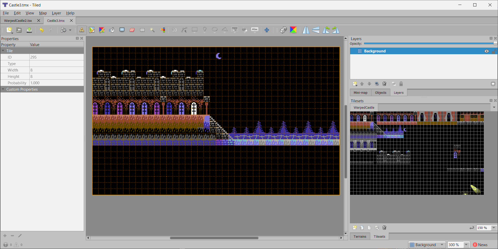

# Setting up a project in Tiled

When Tiled starts up for the first time, or all the tilesets and maps are closed you see the "**No Open Files**" screen.

## Create a Tileset

The first thing you normally do with a new project is to set up a New Tileset. Creating a bitmap image in a C64 image editing program with the tiles and colors you are considering would be a a good choice.

Enter a good name for your tileset in the name field, make sure Type is Based on Tileset Image, then click Browse to select your image.

You need to set the Tile Width and Height in the Tileset, it must be a multiple of 8 in both fields. When you're done you can save the tileset.

You can use as many tilesets as you like in a single map as long as each map uses 256 or less 8x8 characters.

## Customize a Tileset

Once a tileset is created the properties can be edited. If everything looks OK click on the **New..** icon in the toolbar to create a map.

Make sure the Tile Size of a new map matches the Tileset Tile Size, select the size of the map and select **Save As...** to create your map file.

At this point there are better tutorials for working in tiled, but it is straightforward to use just trying things. Mark areas in the Tileset, then use the stamp tool to place them in the map. There are also a fill feature and random feature to build things quickly.

